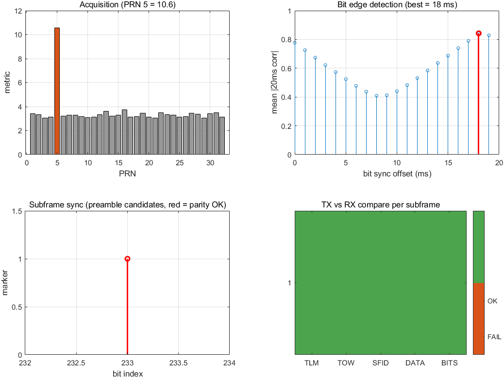

# 连续 GPS 子帧电文收发验证报告（真实环境模拟）

> 日期：2026-08-07
> 结论：**PASS —— 6 秒子帧边界同步成功，电文 0 比特错误**

## 1. 目的

把上一阶段的单段 50 bps 电文验证升级为**真实 GPS 环境模拟**：

- TX 持续发射结构完整的 GPS 导航电文子帧（TLM 前导码 + HOW + 数据字，
  含 ICD-GPS-200 奇偶校验）；
- RX 不依赖任何已知序列，通过**比特边缘检测**（位同步）和
  **6 秒子帧边界同步**（前导码 + 奇偶校验验证）自主同步并解码；
- 发送电文与接收解码逐字段对比（TLM / TOW / 子帧号 / 数据字）。

## 2. 实验设置

| 项 | 值 |
|---|---|
| 射频链路 | 拉杆天线 TX → 有源天线 RX（未接 bias-T，无源接收），间距 1–3 m |
| 中心频率 / 采样率 | 1575.42 MHz / 2.5 MSPS |
| 发射 | PRN 5，TX −65 dB，1 个子帧（300 位 = 6 s）缓冲持续重复 |
| 电文内容 | TLM 前导码 `10001011` + 消息 `010101`；HOW：TOW=80000、子帧号 1；8 个数据字（含字序号） |
| 接收 | `step()` 连续流 1200 帧（12 s），手动增益 20 dB，零削波 |
| 处理链 | 捕获 → 1 ms 剥码去载波 → 比特边缘检测 → 子帧同步 → 字段解码 → 对比 |

## 3. 结果

| 指标 | 值 |
|---|---|
| 捕获 | PRN 5 命中（metric 10.6），多普勒 **+0.0 Hz** |
| 比特边缘检测 | 最优偏移 **18 ms**，边界翻转率 **0.44**（理论正确对齐约 0.5） |
| 子帧同步 | 1 个有效子帧（前导码 + 10 字奇偶校验全部通过），起点位 233 |
| 解码 | TOW=80000，子帧号=1，TLM=010101 |
| 对比 | TLM ✓ / TOW ✓ / 子帧号 ✓ / 数据字 ✓，**比特错误 0** |
| 结论 | **PASS** |

图中四幅子图：捕获指标（PRN5 突出）；位同步能量曲线（18 ms 处峰值）；
子帧同步（红色标记 = 奇偶校验验证通过的子帧起点）；TX/RX 对比矩阵（全绿 = 全对）。

## 4. 方法要点

### 发射端（真实子帧结构）

- `generateGpsSubframe`：逐字组装 TLM/HOW/数据字，按 ICD-GPS-200 §20.3.5.4
  计算 30 位字奇偶校验（D25–D30，含前字 D29/D30 反馈）；
- `generateGnssTxBuffer('NavBits', bits)`：每个电文比特 20 ms = 20 个码周期，
  缓冲为整数码周期/比特，`transmitRepeat` 持续发射。

### 接收端（自主同步，无参考）

1. **捕获**（acquisition）得到码相位/多普勒；
2. **比特边缘检测**（gnssBitEdgeDetect）：
   - 能量法：20 ms 窗口同相叠加，正确对齐时 |和| 最大；
   - 翻转直方图法：`real(c(i)·conj(c(i+1))) < 0` 判相邻 1 ms 符号翻转，
     正确边界处翻转率约 50%，无需绝对载波相位；
   - 双指标综合选取最优偏移。
3. **子帧同步**（gnssSubframeDecode）：搜索 TLM 前导码 `10001011`，
   对候选按 300 位子帧逐字重算奇偶校验，全部通过才确认边界；
4. **极性消除**：BPSK 解调存在 180° 相位模糊，对原样/取反两种极性
   分别做前导码 + 奇偶校验验证，选校验通过者；
5. 解码 TLM/HOW/数据字并与发送端逐字段对比。

## 5. 调试记录（重要）

1. **BPSK 180° 极性模糊**：初版用"能量最大比特的相位"校准残余载波，
   若该比特恰好为 −1（相位 180°），全部符号翻转、前导码消失。
   正确做法：由前导码 + 奇偶校验消除极性模糊（真实 GPS 接收机做法）。
2. **TX 缓冲上限 2^24 采样**：`transmitRepeat` 单缓冲最大 16,777,216 采样，
   2.5 MSPS 下最多 1 个子帧（6 s）；多子帧 TOW 递增留给真实卫星数据。
3. **RX 单帧 capture 上限 2^24**：12 s 采集必须用 `step()` 连续流
   （M1 已验证帧间连续；分块 `capture` 帧间不连续不可用）。
4. **位同步方法选择**：能量法在弱信号下峰/次峰比约 1.0（区分度低）；
   翻转直方图法提供更可靠的边界判据（实测翻转率 0.44）。后续 M3 跟踪环
   可进一步做载波环辅助的位同步。

## 6. 结论与下一步

- 完整链路已验证：**合成子帧 → 连续发射 → 接收 → 比特边缘检测 →
  6 秒子帧边界同步 → 电文解码 → 逐字段对比**，0 比特错误。
- 下一步：bias-T 到货后接真实卫星，同一套处理链可直接解析真实 TLM/HOW
  与星历子帧（Subframe 1/2/3）；M3 跟踪模块（DLL/PLL）可复用本验证的
  TX 发射链路做闭环测试。
