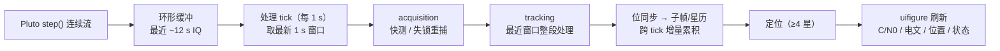

# 实时 GUI（准实时模式）实施计划

> 状态：计划（2026-08-18）｜目标里程碑：M6
> 背景：现有 `gnssLiveGui.m` 为"结果回放"型（先跑完整验证再展示）；
> 本文档规划"边采集边显示"的**准实时模式**（0.5~1 s 刷新粒度），
> 对应 HANDOFF §9.2 未完成项"GUI 实时流：接 Pluto step() 增量跟踪（当前为结果回放）"。

---

## 1. 目标

- 新增 GUI 模式 **Live**：`step()` 连续流 → 每 tick 处理最新窗口 →
  实时更新 **C/N0 滚动曲线 / 解码电文 / 定位结果 / 通道状态**；
- 复用现有已验证模块（`plutoGnssFrontEnd` / `acquisition` / `tracking` /
  `gnssSubframeDecode` / `gnssEphDecode` / `gnssPseudorange` / `leastSquaresPosition`），
  **首版不做逐 ms 环路状态保持**（整窗重处理，后续可增量优化）；
- 刷新率目标 1 Hz（可配 0.5~2 s），处理耗时须小于刷新周期（无累积延迟）。

## 2. 架构

**线程模型（避免 UI 阻塞）**：

- 采集 timer（周期 ~0.2 s）：高频 `step()` 入环形缓冲，只做搬运；
- 处理 timer（周期 1 s）：低频取窗口 → 处理 → 更新结果结构 → `drawnow` 节流刷新。

## 3. 里程碑与验收

| 里程碑 | 内容 | 验收标准 | 估时 |
|---|---|---|---|
| M6.1 | 采集流水线：`step()` 连续流 + 环形缓冲 + 双 timer | 无丢帧、缓冲覆盖正确、内存平稳 | 0.5 天 |
| M6.2 | 处理流水线：每 tick 窗口 acquisition + tracking + 解码 | 合成/回环信号实时出 C/N0，窗口处理 < 1 s | 1 天 |
| M6.3 | GUI Live 模式：C/N0 滚动、电文面板、状态/定位面板、开始/停止 | 交互可用、无累积延迟 | 1 天 |
| M6.4 | 联调验证：真实卫星（PRN 27）与回环低功率 TX | C/N0 实时曲线稳定、电文逐步滚动 | 0.5~1 天 |
| M6.5 | 文档/回归：README、CHANGELOG、验证记录；离线回归 | 回归全过、文档同步 | 0.5 天 |

合计约 **3~4 天**工作量。

## 4. 关键设计决策

1. **刷新率**：默认 1 s（参数可配 0.5~2 s）；处理窗口 1 s（2500×1000 采样）。
2. **环形缓冲**：仅保留最近 ~12 s（覆盖 2 个子帧跨度，支持电文拼接）；
   double complex 12 s ≈ 480 MB（可接受）；内存紧张时改 int16 存储（≈120 MB）。
3. **处理策略（首版）**：每 tick 对最新 1 s 窗口**整段重跑 tracking**，
   不做跨 tick 环路状态保持（简化、稳）；位同步后**电文比特跨 tick 增量拼接**
   （跟踪 bits 追加），子帧/星历在有 ≥600 bit 时解码。
4. **失锁重捕**：tick 内 CN0 < 阈值（如 30 dB-Hz）→ 下一 tick 重新 acquisition。
5. **定位**：≥4 颗可见星才解算并显示（当前真实场景通常 1 星，
   先展示 C/N0 + 电文 + 状态；多星时自动显示位置/GDOP）。
6. **UI**：`uifigure` + 滚动 axes（C/N0 时间曲线）+ 文本面板（电文/状态/位置）；
   `drawnow` 节流，避免每 tick 全量重绘。

## 5. 验证方案

- **回环/合成**（低功率 TX，确定性）：验证实时链路正确性与刷新率指标；
- **真实卫星**：先 6 s 快测确认锁定（C/N0 > 35），再开 Live 模式观察
  C/N0 随时间变化与电文滚动（复用 M5 经验：启动瞬态丢弃、信号随时间衰落）；
- **性能指标**：单 tick 处理耗时 < 刷新周期、无累积延迟、内存平稳、
  帧间隔稳定（复用 M1 判定思路）。

## 6. 风险与对策

| 风险 | 对策 |
|---|---|
| timer 回调内重处理阻塞 UI | 双 timer（采集/处理分离）+ 处理结果缓存 |
| 处理超时（>1 s） | 自适应缩短窗口 / 只处理已锁定星 / 降采样 |
| 内存增长 | 环形覆盖 + int16 存储选项 |
| 电文跨 tick 拼接错误 | 位同步状态持久化 + BPSK 极性一致性校验 |
| MATLAB 实时性天花板 | 准实时（1 s 粒度）已规避逐 ms 要求；后续再评估方案 B |

## 7. 复用与后续

- `step()` 流式"采集-处理-显示"架构可直接复用于 **BPSK/QPSK 实时收发**；
- 增量跟踪接口是本项目从"批量处理"走向"真实时/PS 移植"的中间形态；
- 本期不做的内容：逐 ms 真实时跟踪（方案 B）、MEX/多线程优化、
  2r2t 双通道实时显示。
