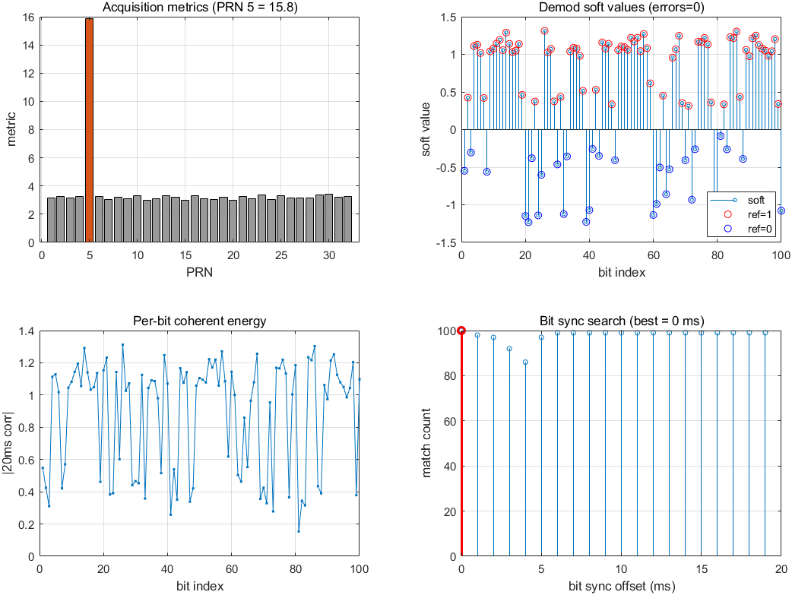

# 50 bps 导航电文合成信号收发验证报告

> 日期：2026-08-07
> 结论：**PASS —— 100 位电文 0 比特错误（匹配率 1.000）**

## 1. 目的

在 M2 捕获模块（FFT 并行码相位搜索）离线与硬件链路验证通过之后，
进一步验证 **50 bps GPS 导航电文的完整调制/解调链路**：
TX 发射带已知电文的合成 GPS L1 C/A 码信号，RX 接收后解调出电文比特，
与发射的参考比特逐位比对。为 M3（跟踪）、M4（子帧/星历解析）铺路。

## 2. 实验设置

| 项 | 值 |
|---|---|
| 射频链路 | 拉杆天线 TX → 有源天线 RX（未接 bias-T，无源接收），间距 1–3 m |
| 中心频率 / 采样率 | 1575.42 MHz / 2.5 MSPS（TX/RX 一致） |
| 发射 | PRN 5，TX 增益 -65 dB，基带幅度 0.1，`transmitRepeat` 持续发射 |
| 接收 | 手动增益 20 dB，capture 2 s（5,000,000 采样），零削波 |
| 电文 | 40 位测试序列（GPS TLM 前导码 `10001011` 开头），缓冲 800 ms = 40×20 ms |
| 捕获 | `acquisition`（5 ms 相干 × 10 块，DopplerStep 100 Hz） |
| 解调 | `demodulateNavBits`：码相位精对齐 → 逐 1 ms 剥码去载波 → 位同步（0–19 ms 搜索）→ 40 位周期参考循环对齐 → 符号判决 |

## 3. 结果

| 指标 | 值 |
|---|---|
| 捕获 | PRN 5 命中，metric 15.8，多普勒 **+0.0 Hz**，其余 PRN 噪声级 |
| 解调位数 | 100（≈2.5 个电文周期） |
| 比特错误 | **0 / 100** |
| 匹配率 | **1.000** |
| 位同步偏移 | 0 ms |

图中四幅子图依次为：捕获指标（PRN5 显著高于其他）、解调软值（正负分布与
参考一致，无错误标记）、每比特相干能量（室内多径导致幅度波动，但不影响判决）、
位同步搜索（0 ms 处匹配峰值）。

## 4. 方法与要点

1. **发射端**：`generateGnssTxBuffer('NavBits', bits)` 生成缓冲——
   每个电文比特 20 ms = 20 个 C/A 码周期，缓冲为整数码周期与整数比特，
   保证 `transmitRepeat` 相位连续（沿用 M1 结论）。
2. **接收端解调**：
   - 用捕获结果（码相位/多普勒）生成本地码并做 ±3 采样精对齐；
   - 逐 1 ms 块剥码、去载波，得到每毫秒相关复数；
   - 按候选位同步偏移（0–19 ms）每 20 ms 相干累加为比特复数；
   - 以能量最大比特校准残余载波相位，取实部符号判决；
   - 与 **40 位周期参考**（循环起点 0–39 搜索）逐位比对。

## 5. 调试记录（重要）

初版实现报告 11/99 比特错误，经排查为**参考对齐 bug**，而非解调问题：

- 错误做法：把 99 位截断参考（`repmat` 后截断）做 `circshift` 循环移位。
  99 不是 40 的倍数，循环移位会在任意位置破坏 navBits 的周期结构，
  得到错误的"参考"，从而产生成簇的假错误。
- 正确做法：直接按 **40 位周期**生成对齐参考
  `ref(mod((0:n-1)+s, 40)+1)`，对循环起点 s 搜索最大匹配。
- 修复后同一组解调数据 **99/99 → 0 错误**，重跑实测 100 位 0 错误。

另观察到室内天线场景下每比特相干能量存在幅度波动（多径/衰落），
但 20 ms 相干积分余量足够，符号判决不受影响。

## 6. 结论与下一步

- 50 bps 导航电文从合成 → 发射 → 接收 → 解调的完整链路已验证通过。
- 捕获输出（码相位/多普勒）可直接作为 M3 跟踪的初始值；
  解调得到的 50 bps 比特流可继续做子帧解析（TLM/HOW 字、奇偶校验、星历），
  属 M4 内容。
- 真实卫星接入后（bias-T 供电），同一套 `acquisition` + `demodulateNavBits`
  流程即可处理真实电文；真实信号还需处理比特边缘检测与 6 秒子帧边界同步。
